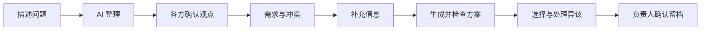
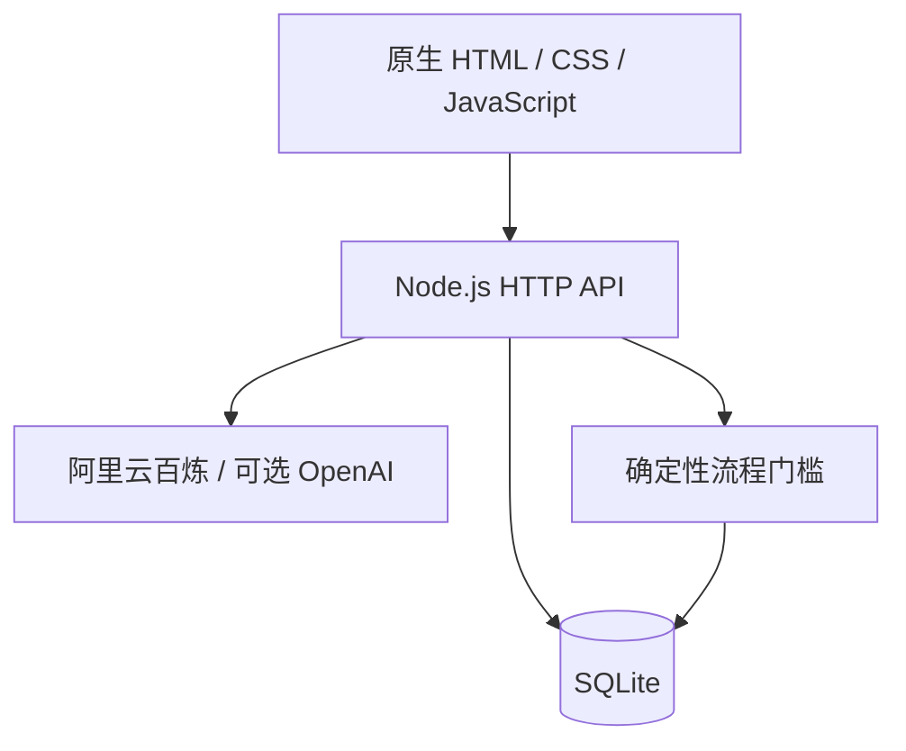
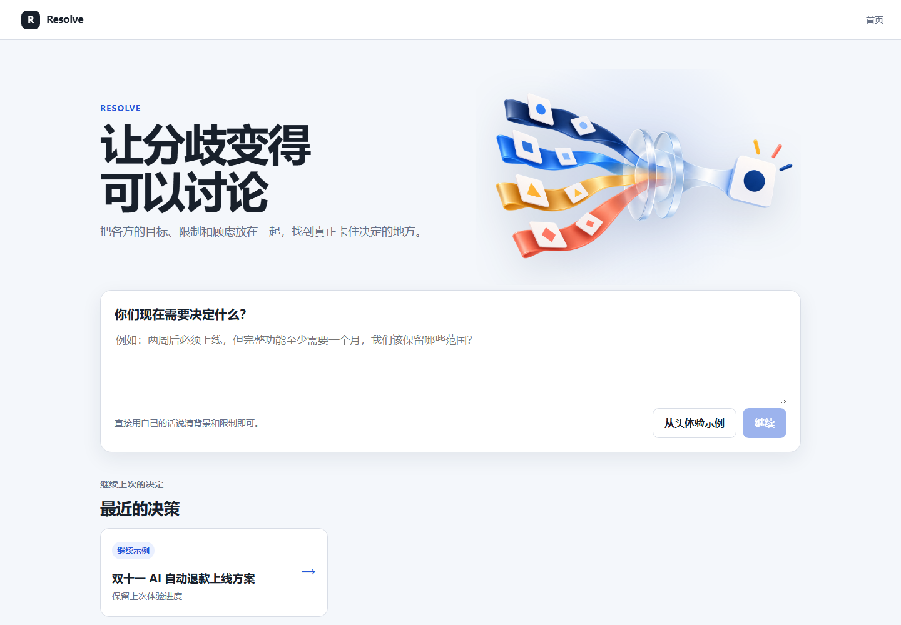
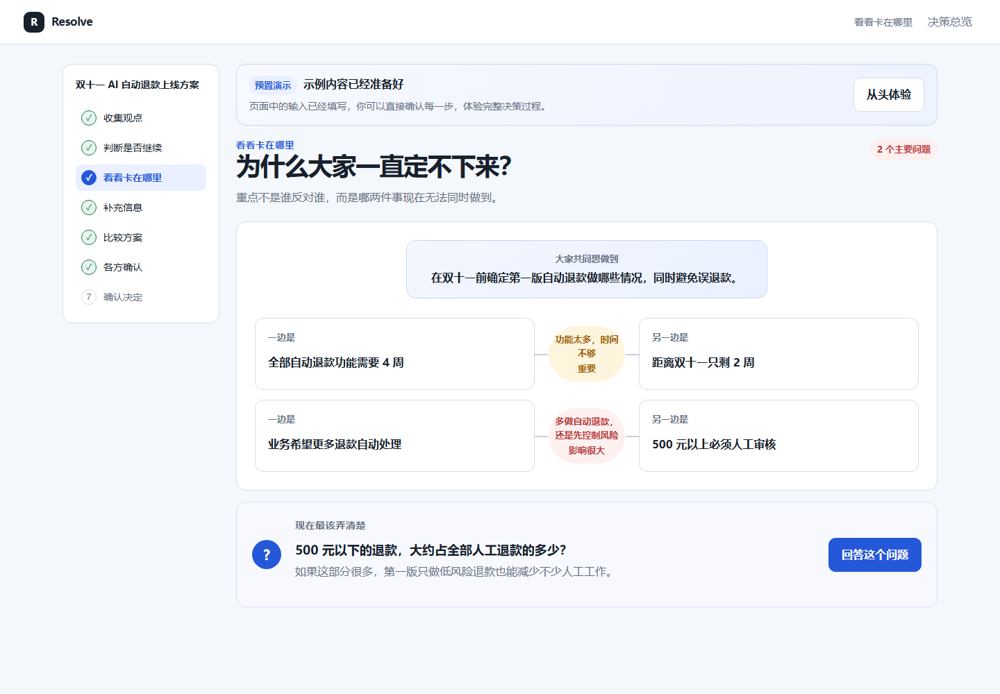
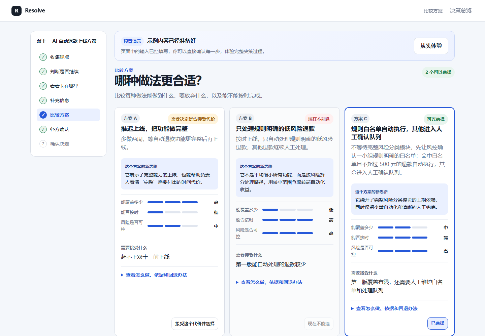
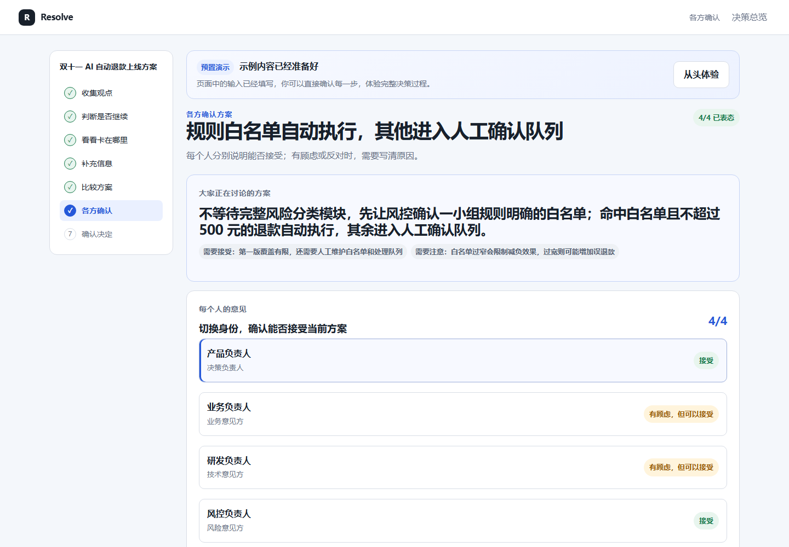
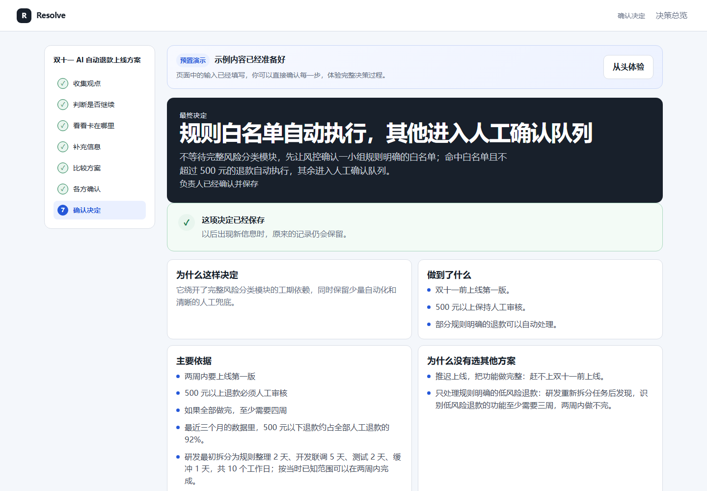

# Resolve

Resolve 是一个面向产品经理和项目负责人的 AI 协作决策工具。它把散落在会议和聊天里的目标、限制、分歧与证据整理成可确认的决策过程，并把最终选择和责任留给人。

当前版本为本地可运行纵向 MVP V0.7，开放“工作 → 产品与研发”。生活、学习及其他工作领域保留扩展入口。

## 当前可用能力

- 用自然语言描述任意产品决策，由 AI 整理目标、参与者、限制和信息缺口。
- 本地操作者切换参与者身份，提交并确认各方观点。
- 完成需求判断、冲突关系图、关键问题、候选方案和方案检查。
- 方案缺证据时可以补充信息并重新生成、检查，不把失败结果伪装成成功。
- 提交异议并识别受影响方案，阻止不安全的最终确认。
- 将决定、理由、代价、风险、责任人与重开条件保存为决策记录。
- 使用 SQLite 保存过程；刷新页面或重启服务后可以继续。
- 未配置模型时主动查看“AI 自动退款”完整示例，不用固定数据冒充实时结果。

## 核心流程



## 系统结构



模型负责理解、诊断、生成候选方案和检查风险；程序负责状态、持久化与门槛；人负责确认观点、判断需求价值、选择方案和承担最终责任。

## 产品界面

### 从问题开始



### 看清冲突并比较取舍

| 冲突关系图 | 方案比较 |
|---|---|
|  |  |

### 收集审阅并形成记录

| 方案审阅 | 最终确认预览 |
|---|---|
|  |  |

## 本地运行

需要 Node.js 20 或更高版本。

```powershell
npm ci
Copy-Item .env.example .env
npm start
```

打开 `http://127.0.0.1:4173/`。

如需创建自己的决策，在 `.env` 中填写阿里云百炼 `DASHSCOPE_API_KEY`。默认模型为固定快照 `qwen3.7-plus-2026-05-26`；`qwen3.8-flash` 用作低成本基线，`qwen3.8-max-0902` 用于困难案例复核。密钥、数据库和个人运行结果均被 Git 忽略。

没有密钥也能从首页打开完整示例。AI 调用失败时，系统保留输入并提供重试，不会自动填入示例结果。

## 验证

```powershell
npm run check
npm test
npm run public:check
```

自动化测试覆盖数据库初始化、示例导入、决策创建、事件保存、关键流程门槛和服务重启后的数据恢复。

每次推送和 Pull Request 都会由 GitHub Actions 自动执行依赖安装、源码检查、测试和公开仓库检查。

配置有效百炼密钥后，还可以运行隔离数据库上的纵向流程评测：

```powershell
npm run eval:flow -- --limit=1
```

也可以使用 `--cases=RF-002,RF-003` 只运行指定案例。它会验证真实模型从问题整理到最终留档的闭环；评测数据库在临时目录中创建，不会改动日常示例。

公开前运行 `npm run public:check`，检查密钥、运行数据库、评测结果和不应出现在主界面的开发说明是否已被排除。

配置有效百炼密钥并启动服务后，可以运行：

```powershell
npm run eval:smoke
```

这会执行 10 个 ResolveBench 冒烟案例，记录通过率、错误、耗时与 token 用量。若在 `.env` 中填写当前模型的输入/输出单价，还会估算本次成本。

还可以使用同一模型比较“一次性给建议”和 Resolve 结构化入口：

```powershell
npm run eval:baseline -- --limit=5
```

本轮 6 例内部案例汇总中，一次性建议平均检查得分为 78.6%，Resolve 为 95.3%；详细限制见《工作流基线对照报告》。

## 核心接口

| 接口 | 用途 |
|---|---|
| `GET/POST /api/decisions` | 列出或创建决策 |
| `GET /api/decisions/:id` | 读取完整决策快照 |
| `POST /api/decisions/:id/events` | 保存确认、选择、异议和最终决定 |
| `POST /api/decisions/:id/ai/diagnose` | 需求、冲突和澄清问题 |
| `POST /api/decisions/:id/ai/propose` | 生成候选方案 |
| `POST /api/decisions/:id/ai/validate` | 检查方案 |
| `POST /api/decisions/:id/ai/objection` | 理解异议及影响范围 |

## 精选项目资料

- [Mini PRD](docs/02_Resolve_Mini_PRD_V1.md)：回答产品问题、目标用户、MVP 范围和验收边界。
- [AI 方案与评测设计](docs/04_AI方案与评测设计.md)：回答模型、程序和人工如何分工，以及实验如何设计。
- [ResolveBench](evals/README.md)：回答测试集、规则检查和纵向评测如何运行。
- [模型对比实验报告](docs/09_模型对比实验报告.md)：回答为什么选择 Plus，而不是 Flash 或 Max。
- [工作流基线对照报告](docs/10_工作流基线对照报告.md)：回答结构化入口相比一次性建议带来了什么。
- [项目案例一页版](docs/11_项目案例一页版.md)：集中呈现问题、关键判断、坏案例迭代、结果和限制。

## 已知限制

- 当前是单机、单操作者切换角色的协作流程，不包含真实账号、邀请、组织权限或多人实时协作。
- 生活、学习及其他工作领域尚未实现完整流程。
- 尚未完成真实用户验证；产品价值与使用意愿不能据此视为已证明。
- 已用有效百炼密钥完成三模型对比、稳定性复测和 5 例 Holdout 检查：Plus 连续 3 轮 Smoke 均为 100%，Max 两轮平均 95%，Flash 两轮均为 30%，Plus Holdout 为 5/5。这仍是项目内部测试结果，不代表真实用户效果。
- 已完成 3 个纵向案例的真实流程试跑，最终均至少完整通过一次；平均耗时约 47 秒，三例通过运行合计估算模型成本约 ¥0.1223。RF-002 首次因测试输入缺少流量、路由准确率和分层成本而安全停住，补齐对应证据后回归通过。结果用于验证流程和恢复路径，不代表真实用户效果。
- 当前保持本地运行，不计划部署在线演示站；源码与精选文档已按确认范围公开，敏感配置、个人运行数据和内部过程材料继续仅保存在本地。

## 许可证

本项目采用 [MIT License](LICENSE)。
