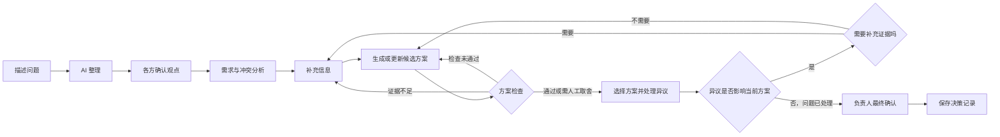
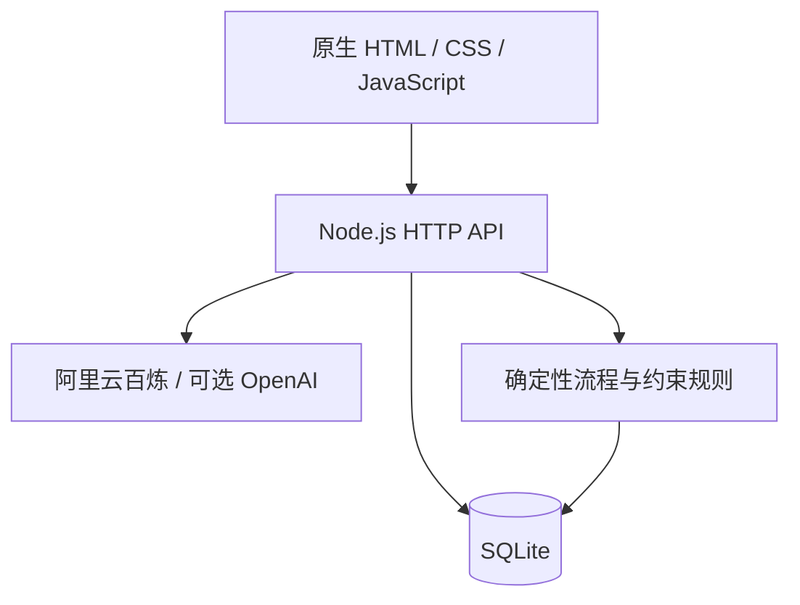

# Resolve｜AI 协作决策平台

Resolve 面向工作、生活和学习中的多人复杂决策场景。当参与者有不同目标、限制和意见时，系统帮助大家梳理各方诉求、发现冲突和信息缺口、比较候选方案，并记录最终取舍及依据。

AI 负责分析和辅助，人负责判断需求是否值得继续、处理关键取舍并完成最终决策。当前本地可运行 MVP V0.7 仅完整实现“工作 → 产品与研发”；生活、学习及其他工作领域只保留入口或后续扩展规划。

## 为什么做 Resolve

复杂协作决策中的信息经常散落在群聊、会议和表格里。参与者说出的目标、硬约束、偏好、假设和证据容易混在一起，同一句“必须做”可能代表完全不同的分量。

普通投票可以统计立场，却难以处理专业否决条件、新证据和持续变化；普通 Chatbot 则可能在信息不足时，仍然给出一份看似完整的建议。即使讨论暂时结束，团队也常常难以追溯：为什么选择这个方案、谁负责执行、还有哪些风险、什么情况下应该重新打开决策。

Resolve 的目标不是替人拍板，而是帮助参与者看清问题、补齐信息、比较取舍，并形成一份可以回看的决策记录。

## 产品范围

| 一级场景 | 决策分支示例 | 当前状态 |
|---|---|---|
| 工作 | 产品与研发、项目与资源、运营与增长、客户与商务、团队与组织 | 产品与研发已实现，其余待扩展 |
| 生活 | 旅行、聚餐、共同消费、家庭选择、朋友活动 | 入口已展示，流程待扩展 |
| 学习 | 小组作业、选题、分工、竞赛、升学与学习路径 | 入口已展示，流程待扩展 |

工作、生活和学习是平台的总体规划。当前只有“工作 → 产品与研发”具备完整流程，其他分支不能视为已经实现。

这里的 Agentic 指多个功能明确、受流程约束的 AI 任务协同完成需求分析、冲突澄清、方案生成、方案检查和异议处理；当前并不是多个自治 Agent 自由沟通和自主协商的正式 Multi-Agent 系统。

## 当前 MVP 已实现能力

- 用自然语言描述产品决策，由 AI 整理目标、相关人员、限制和信息缺口。
- 在本地切换参与者身份，分别提交并确认各方观点。
- 由负责人完成人工需求判断，再查看冲突关系和关键澄清问题。
- 生成 2—3 个取舍方向不同的候选方案，并分别检查限制、证据和风险。
- 方案缺少证据时，可以补充信息、重新生成并重新检查，而不是停在不可操作的页面。
- 各参与者可提交接受、顾虑或反对意见，AI 分析异议影响了哪些方案。
- 存在未处理异议或关键条件未满足时，阻止进入最终确认。
- 将决定、理由、代价、风险、责任人和重新讨论条件保存为决策记录。
- 使用 SQLite 保存过程，刷新页面或重启服务后仍可继续。
- 未配置模型时，可以主动查看预置的“AI 自动退款”产品决策示例；自定义任务失败时不会用示例数据冒充实时结果。

## 核心流程



流程允许暂停、补充信息和重新处理。只有关键条件满足、影响当前方案的异议已经处理后，负责人才能完成最终确认。

## 产品界面

### 从问题开始


### 看清冲突并比较取舍

| 冲突关系图 | 方案比较 |
|---|---|
|  |  |

### 收集审阅并形成记录

| 方案审阅 | 最终确认预览 |
|---|---|
|  |  |

## 关键 Bad Case 与迭代

### 1. 证据不足后，流程没有继续路径

- **用户现象**：方案因证据不足被拦截后，页面只显示不可选择，用户无法继续推进。
- **原因**：早期流程只考虑了“检查通过”和“检查失败”，没有把补证据后的恢复过程做成产品路径。
- **修改**：增加“补充信息 → 重新生成方案 → 重新检查”的恢复链路，并区分可通过、需人工取舍、待补证据和不可执行四种状态。
- **结果**：用户可以补齐证据后继续流程，而不是卡在禁用状态。

### 2. 已确认观点没有完整进入后续 AI 上下文

- **用户现象**：后续诊断和方案分析遗漏了部分参与者已经确认的观点。
- **原因**：决策快照的上下文组装没有完整包含参与者观点对象。
- **修改**：修复上下文组装逻辑，确保确认后的观点进入后续诊断、方案生成和检查任务。
- **结果**：后续 AI 分析能够与已确认信息保持一致。

### 3. 模型失败时，固定示例可能被误认为真实结果

- **用户现象**：模型调用失败后自动填入预置内容，容易让用户误以为这是针对自己问题生成的结果。
- **原因**：实时分析与演示数据只靠文字标注区分，交互路径不够清楚。
- **修改**：将预置示例改为独立、明确的入口；自定义任务调用失败时只保留用户输入并提供重试，不自动填充示例。
- **结果**：失败状态、预置案例和真实 AI 输出之间的边界更加清楚。

## AI 与人的分工

Resolve 使用 Human-in-the-Loop（HITL）：AI 负责处理信息，但关键判断必须由人确认。

| AI | 确定性程序 | 人 |
|---|---|---|
| 理解问题、整理诉求、发现冲突和信息缺口 | 管理流程状态和允许的下一步 | 确认自己的观点是否被正确理解 |
| 生成候选方案并检查限制、证据和风险 | 保存决策、参与者、对象版本、事件和 AI 运行记录 | 判断需求是否值得继续，补充证据 |
| 分析异议类型及受影响方案 | 在关键条件未满足时阻止继续 | 处理取舍、选择方案并完成最终决策 |

## 关键评测结果

| 评测 | 结果 | 用途与边界 |
|---|---|---|
| Plus Smoke 稳定性复测 | 连续 3 轮均为 10/10 | 检查当前提示词与结构化输出在 10 个内部案例上的稳定性 |
| Plus Holdout | 5/5 | 检查模型在 5 个未参与首轮提示调整的内部案例上是否立即失效 |
| 一次性建议 vs Resolve 结构化入口 | 平均检查得分 78.6% vs 95.3% | 比较参与者、冲突、信息缺口、约束类型、下一步和人工边界的覆盖情况 |
| 纵向 Flow | 3 个案例最终均至少完整通过一次 | 验证从问题整理、暂停补证据到最终留档的流程能够运行 |
| 纵向 Flow 成本与耗时 | 平均约 47 秒；三例通过运行合计估算模型成本约 ¥0.1223 | 用于观察当前工作流的时间与模型调用成本 |

以上均为内部工程评测，用于验证工作流与模型选择，不代表真实用户效果或业务收益。Smoke 和 Holdout 的通过率是项目规则检查结果，不是通用准确率；3 个纵向案例也不是全部首次通过。

模型选型结果和完整实验边界见[模型对比实验报告](docs/09_模型对比实验报告.md)与[工作流基线对照报告](docs/10_工作流基线对照报告.md)。

## 系统结构



默认模型为阿里云百炼固定快照 `qwen3.7-plus-2026-05-26`；`qwen3.8-flash` 用于低成本基线，`qwen3.8-max-0902` 用于困难案例复核。所有核心模型任务使用严格 JSON Schema，服务端再次校验字段、类型、数量和枚举值，避免模型输出格式异常直接影响后续流程状态。

SQLite 保存决策、参与者、结构化对象、历史事件和 AI 运行记录。API 密钥只存放在本地 `.env`，不进入前端、数据库或公开仓库。

## 本地运行

需要 Node.js 20 或更高版本。

```powershell
npm ci
Copy-Item .env.example .env
npm start
```

打开 `http://127.0.0.1:4173/`。

如需创建自己的决策，在 `.env` 中填写阿里云百炼 `DASHSCOPE_API_KEY`。没有密钥也可以从首页打开预置示例。AI 调用失败时，系统保留输入并提供重试，不会自动填入示例结果。

## 验证命令

### 源码、接口测试与公开检查

```powershell
npm run check
npm test
npm run public:check
```

自动化测试覆盖数据库初始化、示例导入、决策创建、事件保存、关键流程限制和服务重启后的数据恢复。每次推送和 Pull Request 都会由 GitHub Actions 自动执行依赖安装、源码检查、测试和公开仓库检查。

### Smoke 与本地 Holdout

配置有效百炼密钥并启动服务后运行：

```powershell
npm run eval:smoke
npm run eval:smoke -- --dataset=resolvebench_holdout.json
```

Smoke 执行 10 个 ResolveBench 冒烟案例；Holdout 文件只保存在本地。脚本记录通过率、错误、耗时和 token 用量；如在 `.env` 填写模型单价，也会估算成本。

### 纵向 Flow

```powershell
npm run eval:flow -- --limit=1
npm run eval:flow -- --cases=RF-002,RF-003
```

Flow 使用隔离的临时数据库验证从问题整理到最终留档的闭环，不会改动日常示例。

### 一次性建议基线

```powershell
npm run eval:baseline -- --limit=5
```

该实验使用同一模型，比较“一次性给建议”和 Resolve 结构化入口。原始个人运行结果默认不提交公开仓库。

## 核心接口

| 接口 | 用户流程中的作用 |
|---|---|
| `GET/POST /api/decisions` | 读取最近决策或创建新的决策空间 |
| `GET /api/decisions/:id` | 恢复完整决策状态 |
| `POST /api/decisions/:id/events` | 保存观点确认、需求判断、方案选择、审阅、异议和最终决定 |
| `POST /api/decisions/:id/ai/diagnose` | 分析需求证据、冲突和关键问题 |
| `POST /api/decisions/:id/ai/propose` | 生成候选方案 |
| `POST /api/decisions/:id/ai/validate` | 检查候选方案的限制、证据和取舍 |
| `POST /api/decisions/:id/ai/objection` | 理解异议及其影响范围 |

## 精选项目资料

- [Mini PRD](docs/02_Resolve_Mini_PRD_V1.md)：产品问题、目标用户、MVP 范围和验收边界。
- [AI 方案与评测设计](docs/04_AI方案与评测设计.md)：模型、确定性程序与人的分工，以及实验设计。
- [ResolveBench](evals/README.md)：测试集、规则检查和纵向评测的运行方式。
- [模型对比实验报告](docs/09_模型对比实验报告.md)：选择 Plus 而不是 Flash 或 Max 的依据。
- [工作流基线对照报告](docs/10_工作流基线对照报告.md)：结构化入口与一次性建议的早期对照结果。
- [项目案例一页版](docs/11_项目案例一页版.md)：问题、关键判断、Bad Case、结果和限制。

## 已知限制

- 当前是单机、单操作者切换角色的协作流程，不包含真实账号、邀请、组织权限或多人实时协作。
- 生活、学习及其他工作领域尚未实现完整流程。
- 尚未完成真实用户验证，当前结果不能证明产品价值、使用意愿或业务收益。
- 当前模型对比、Holdout、工作流基线和纵向 Flow 都是内部工程评测，不能当作真实用户效果或外部盲测。
- 异议后的完整自动局部再生成、完整版本重开和企业级权限仍未实现。
- 当前保持本地运行，没有在线演示站；源码与精选文档已按确认范围公开。

## 许可证

本项目采用 [MIT License](LICENSE)。
